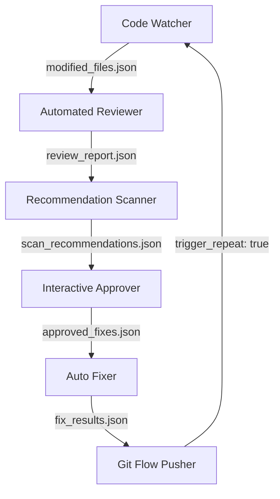

# GITflow the plugins for Antigravity

> The perfect skills repository to create trash

This plugin groups a set of 6 modular skills designed to automate git and quality-assurance pipelines inside the Antigravity developer environment.

## Pipeline Architecture

The pipeline follows a closed-loop automated lifecycle:
`Code ➔ Review ➔ Scan Recommendations ➔ Approve ➔ Auto-fix ➔ GitHub Push ➔ Repeat`

## Available Skills

1. **code-watcher**: Monitors the active workspace for modified files and collects diff metadata.
2. **automated-reviewer**: Performs static code review, flagging syntax and logic issues.
3. **recommendation-scanner**: Runs security audits and drafts specific code replacement suggestions.
4. **interactive-approver**: Prompts the user to approve or reject the suggested modifications.
5. **auto-fixer**: Applies approved fixes, formats codebase, and validates build/test stability.
6. **git-flow-pusher**: Commits modifications with Conventional Commits rules and pushes them back to GitHub.

## How to Use

To use your agent with these skills, ask your agent to consider this repository as a group of skills and save it in its memory with any name or preserve this one. After the previous step, ask your agent in the following way: *"Use Skills GitFlow in this project immediately"*. In theory, it should work 😊
